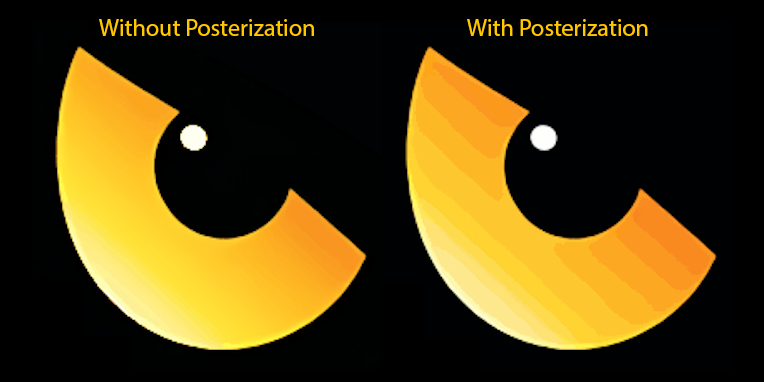

# Color Shift GIF

Python script that takes an image and turns it into a color changing GIF.

## Example


## Setup

```bash
git clone https://github.com/ganttArt/color-shift-gif.git
cd color-shift-gif
python3 -m venv venv
. venv/bin/activate
pip install -r requirements.txt
deactivate
```

## Run

```bash
. venv/bin/activate
python main.py -f <image-filename>
```

### Optional Command Line Arguments

- `-f <filename>` `--file <filename>`: File name for image to apply effect to.
  - Include relative path if file is not in root directory.
- `-d <seconds>` `--duration <seconds>`: Duration of gif in seconds. Default is 10 seconds.
- `-nl` `--noloop`: Create a GIF that doesn't loop
- `-t` `--transparent`: Maintain transparency of input image in GIF.
  - Note: Semi-transparent pixels will convert to fully transparent pixels. GIF image format does not support semi-transparent pixels
- `-p` `--posterize`: Create posterize effect in GIF (experimental effect, works poorly for some images)
  - 
